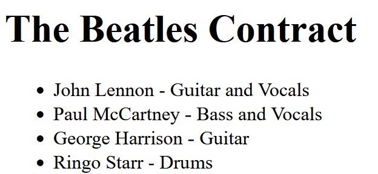

# Interacting With Smart Contracts

The following contract is deployed to Ehtereum's Ropsten Testnet:

```
pragma solidity ^0.8.16;
// SPDX-License-Identifier: MIT

contract TheBeatles {
    struct Beatle {
        string _name;
        string _instrument;
    }
    Beatle[] beatles;

    constructor() {
        beatles.push(Beatle("John Lennon", "Guitar and Vocals"));
        beatles.push(Beatle("Paul McCartney", "Bass and Vocals")); 
        beatles.push(Beatle("George Harrison", "Guitar")); 
        beatles.push(Beatle("Ringo Starr", "Drums"));
    }

    function addBeatle(string memory _name, string memory _instrument) public {
        beatles.push(Beatle(_name, _instrument));
    }

    function getBeatles() public view returns (Beatle[] memory) {
        return beatles;
    }
}
```

---

In the `src` folder you'll see an HTML file and a JavaScript file. The HTML file does not need to be changed.

Using the **web3.js** library Edit the JavaScript file so that:

1. When the page loads, it calls the getBeatles function from the deployed contract, and displays the results in the list `<ul id="beatles">`. You can put the name and instrument name in the same `<li>`, as in: `<li>John Doe - Piano</li>`; no additional elements necessary. 
2. When `<form id="newBeatleForm">` is submitted, call the addBeatle function from the deployed contract and pass the *name* and *instrument* valued from the corresponding inputs. Add **Eric Claptop - Guitar** to the onchain *beatles* list. Sign the transaction using the included *senderAddress* and *privateKey* from the JavaScript file. Use a *gas* value of 1000000.

---

**The web3 library is already included and initialized.**

**The contract address and ABI are included in the JS file.**

**You can use JQuery or React, but this can be solved in plain vanilla JS.**


